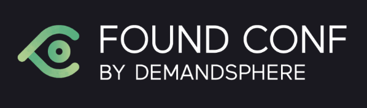

# Presentation repo for Search ‘n Stuff Antalya Global Digital Marketing Conference 2025

Feel free to share any feedback, bugs, suggestions, or questions through the [issues tab.](https://github.com/eliasdabbas/searchnstuff/issues)

## [Absolute beginner, start here](https://www.youtube.com/watch?v=QKLDaDYOLv8)

Install Python, install a few packages, and get started by crawling a website, all in 8 minutes:

## [Beginners workshop](beginners_workshop.ipynb)

Get started with the absolute basics. Zero knowledge required. Create variables, use variables, create lists, install packages.

